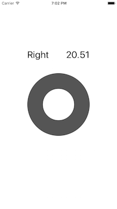
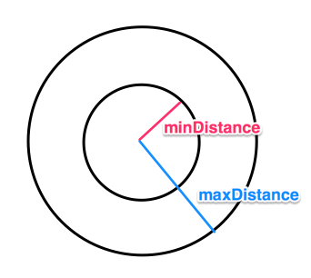

# UIWheelGestureRecognizer

Subclass of UIGestureRecognizer for wheel touch



## Usage

ViewController.swift
```swift
let winder = UIWheelGestureRecognizer()
winder.minDistance = 50
winder.maxDistance = 100
winder.setHandler { (recognizer) -> (Void) in
  if recognizer.state == .Changed {
    print("\(recognizer.direction.rawValue), \(recognizer.angle)")
  }
}
tracker.addGestureRecognizer(winder)
```

## Parameters

**minDistance**  < Touch Recognizing Area < **maxDistance**



## License

Under MIT License.
